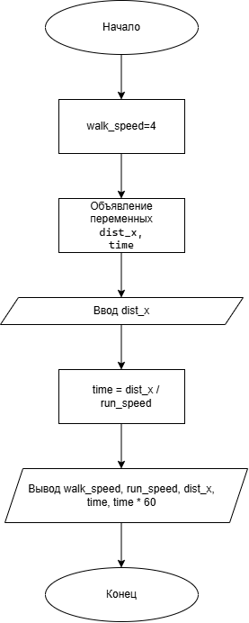

# Домашнее задание к работе 2
## Условие задачи:
Мальчик может бегать в три раза быстрее, чем ходить. Скорость его ходьбы равна 4 км/час. Он принял участие в марафонском забеге, но сошёл с дистанции, пробежав только x км. Сколько времени он затратил на преодоление этого расстояния?

## 1. Алгоритм и блок-схема
### Алгоритм
```
1)Начало.
2)Объявить константу:
walk_speed = 4 (км/ч) — скорость ходьбы мальчика.
3)Вычислить скорость бега:
run_speed = walk_speed * 3
4)Ввести исходные данные:
x — расстояние, которое пробежал мальчик (км).
5)Вычислить затраченное время:
time = x / run_speed
6)Вывести результаты расчётов с подстановкой всех значений в текст.
7)Конец.
```
### Блок-схема


## 2. Реализация программы
```
#define _CRT_SECURE_NO_WARNINGS
#include <stdio.h>
#include <locale.h>

int main() 
{
    setlocale(LC_ALL, "RUS");
    float walk_speed = 4.0;
    float run_speed;
    float dist_x;
    float time;
    run_speed = walk_speed * 3.0;
    printf("Введите расстояние x (в км), которое пробежал мальчик: ");
    scanf("%f", &dist_x);
    time = dist_x / run_speed;
    printf("Результаты:\n");
    printf("Скорость ходьбы: %.2f км/ч\n", walk_speed);
    printf("Скорость бега:   %.2f км/ч\n", run_speed);
    printf("Пройденное расстояние: %.2f км\n", dist_x);
    printf("Затраченное время: %.4f часов\n", time);
    printf("Это составляет примерно %.2f минут.\n", time * 60);
}
```
### 3. Результаты работы программы
```
(Ниже приведён пример вывода для x = 6. Если запускаете с другим числом — замените вывод на свой.)

Введите расстояние x (в км), которое пробежал мальчик: 6

Результаты:
Скорость ходьбы: 4.00 км/ч
Скорость бега:   12.00 км/ч
Пройденное расстояние: 6.00 км
Затраченное время: 0.5000 часов
Это составляет примерно 30.00 минут.
```
### 4. Информация о разработчике
Дегтярева Полина, бИЦТ-262
